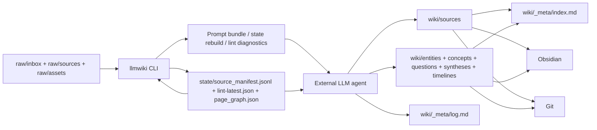

# llm-wiki 完整实施计划（MVP 与 Agent 辅助 CLI）

## Overview

本计划用于将 `docs/llm-wiki.md` 的抽象理念、`docs/llm-wiki-plan-summary.md` 与 `docs/llm-wiki-starter.zip` 中的仓库模板，以及 `docs/pure-karpathy-core-plan.md` 中的纯内核 CLI 思路，整合为一条可实施、可分阶段交付、可由 agent 协作推进的统一路线。

计划的核心取向是：以本地 Markdown Wiki 作为持续积累的知识中间层，以 `AGENTS.md` 作为行为约束，以 Git 作为承载与审阅机制，以 provider-neutral CLI 作为确定性辅助层，而不是把系统做成一次性问答或 RAG-first 工具。

## Current Status

- 已完成：Unit 1 至 Unit 6，对应 starter 骨架、Rust CLI、状态重建、索引维护、日志追加、provider-neutral `ingest` / `ask` / `lint` 命令、测试与文档统一。
- 已完成：Unit 7 中“试运行手册与搜索扩容门槛文档”这一前置交付，对应 `docs/PILOT_RUNBOOK.md`、`docs/SEARCH_SCALING.md` 与 `BACKLOG.csv` 更新。
- 尚未完成：严格意义上的“真实语料试运行”本身。该部分需要实际来源集合与连续 ingest / ask / lint 操作记录，当前仓库尚未提供这批真实资料，因此整份计划状态仍保持 `active`，而不是 `completed`。
- 结论：技术实施层已完成；真实内容驱动的使用层仍待执行。

## Problem Frame

当前三份材料已经分别回答了“为什么做”“仓库长什么样”“CLI 应承担什么边界”，但仍存在四类未统一之处：

- 仓库模板与纯内核方案在目录细节上并不完全一致，例如 `index.md` / `log.md` 是位于仓库根目录还是 `wiki/_meta/`。
- 模板将 frontmatter 设为强约束，纯内核方案则强调尽量避免过度机器强约束。
- 模板将未来自动化表述为 `llmwiki ingest / ask / lint / rebuild-index / sync-state`，纯内核方案则将 CLI 限定为 provider-neutral 的确定性辅助工具。
- 模板倾向于较完整的 starter 包，纯内核方案则强调先做最小可用、再按规模扩展。

如果这些分歧不先收敛，后续无论由人还是 agent 推进，都容易出现“仓库骨架、文档规范、CLI 行为、验收标准”彼此脱节的问题。

## Requirements Trace

- R1. 系统必须以“原始资料层 `raw/` + 知识层 `wiki/` + 行为规范层 `AGENTS.md`”三层结构为基础，而非查询时临时拼装的 RAG-first 方案。
- R2. `raw/` 必须保持只读事实层；知识写入、交叉引用、综合与沉淀均发生在 `wiki/`。
- R3. 每次 `ingest`、`ask`、`lint` 后，都必须维护 `wiki/_meta/index.md` 与 `wiki/_meta/log.md`，并保留来源可追溯性。
- R4. 高价值问答不得只停留在对话中，必须能够沉淀为 `wiki/questions/` 或 `wiki/syntheses/` 页面。
- R5. CLI 必须保持 provider-neutral、可跨平台、以确定性辅助为主，不内置模型调用或自治式 ingest / query 执行。
- R6. 在 CLI 尚未完整落地之前，仓库模板本身就应能够支持“Obsidian + agent + Git”的人工监督闭环。
- R7. `state/` 只能保存可删除、可重建的派生状态，不得成为事实源。
- R8. 搜索增强、向量检索与更复杂的状态索引必须以后置扩展方式接入，不得破坏 MVP 的文件系统真源设计。

## Scope Boundaries

- 不在 MVP 中内置 OpenAI、Anthropic、本地模型或任何 provider SDK。
- 不在 MVP 中引入向量库、在线数据库、云端多租户、复杂权限模型。
- 不在 MVP 中将 `lint` 扩展为自动改写或自动删除页面的自治系统。
- 不在 MVP 中把 GitHub / GitLab / Gitea API、hooks、PR 自动化作为架构前提。
- 不在 MVP 中优先接入 qmd、BM25、向量搜索；只有在真实规模触发门槛后才进入搜索增强阶段。

## Context & Research

### Relevant Code and Patterns

- `docs/llm-wiki.md` 定义了产品原型：持久化 Wiki、增量 ingest、index-first query、lint 健康检查、以及“把答案重新写回 Wiki”的知识复利模式。
- `docs/llm-wiki-plan-summary.md` 明确了 starter 包方向：`raw/`、`wiki/`、`templates/`、`state/`、`docs/`、严格 frontmatter，以及面向 `ingest / ask / lint / rebuild-index / sync-state` 的命令心智。
- `docs/pure-karpathy-core-plan.md` 明确了 CLI 的边界：不接 provider、不替代 agent，只做初始化、扫描、重建、提示词生成、机械 lint 与跨平台路径处理。
- `docs/llm-wiki-starter.zip` 已经给出拟采用的仓库形态：`wiki/_meta/index.md`、`wiki/_meta/log.md`、`templates/*.md`、`docs/ARCHITECTURE.md`、`docs/EXECUTION_PLAN_zh.md`、`BACKLOG.csv`，以及一份较完整的 `AGENTS.md`。
- 当前仓库尚无可执行代码；本计划既要覆盖 starter 落地，也要覆盖第一版 CLI 的实现顺序。

### Institutional Learnings

- 当前仓库中不存在可复用的 `docs/solutions/` 经验文档；本次规划以三份源文档与 starter 包为主要本地依据。

### External References

- 本轮规划不依赖外部文档。当前要收敛的是本仓库内部的产品契约与工程边界，本地材料已经足够具体。

## Key Technical Decisions

- 决策 1：采用 starter 模板作为规范化仓库骨架，保留 `raw/`、`wiki/`、`templates/`、`state/`、`docs/`，并将 `index.md` / `log.md` 统一放在 `wiki/_meta/` 下，而不是仓库根目录。
  理由：这与已打包的 starter、`AGENTS.md` 约定和未来 Obsidian 浏览方式保持一致，也更利于将内容页与运维元数据分层。

- 决策 2：采用 starter 的 page taxonomy 与 frontmatter 契约作为“agent 写入规范”，但 CLI 读取器保持宽容模式。
  理由：写入端需要纪律，读取端需要韧性。agent 生成页面时必须遵守 frontmatter；CLI 在扫描时应将缺失字段视为 lint 问题，而不是直接拒绝整个仓库。

- 决策 3：CLI 采用 Rust 实现，并统一对外暴露 `llmwiki init`、`llmwiki ingest`、`llmwiki ask`、`llmwiki lint`、`llmwiki rebuild-index`、`llmwiki sync-state`、`llmwiki recent`、`llmwiki list`。
  理由：`docs/pure-karpathy-core-plan.md` 已经把 Rust CLI 的职责、模块与 Windows 兼容要求定义得最清楚；同时模板中的命令语义更贴近使用者心智，适合作为稳定的公共命令面。

- 决策 4：`llmwiki ingest` 与 `llmwiki ask` 的含义是“agent 辅助编排”，而不是“CLI 直接调用模型完成工作”。
  理由：这既保持了原始设计中“LLM 写 Wiki”的工作方式，也落实了纯内核方案中的 provider-neutral 边界。命令负责预检查、提示词生成、目标路径建议、状态回填与日志辅助，不负责模型执行。

- 决策 5：MVP 的 `state/` 只落地轻量、可重建的文件型派生状态，例如 `state/source_manifest.jsonl`、`state/lint-latest.json`、`state/page_graph.json`。
  理由：这同时满足模板中的“派生状态层”与纯内核方案中的“不要过早引入数据库”。`state/wiki.db` 被明确延后，待试运行确认确有必要后再评估。

- 决策 6：搜索增强采用“门槛触发”而非预置集成。
  理由：在 20–100 条来源规模内，`wiki/_meta/index.md` 与 `state/` 图谱足以支撑 index-first 导航；只有当真实试运行出现召回不足、响应迟缓或页量明显扩大时，才评估 qmd 或自研本地搜索。

- 决策 7：Git 仅作为承载层、审阅层与回滚层，不上升为自动化编排引擎。
  理由：这可保留原始设计中“Wiki 就是一个 Git 仓库”的优点，同时避免在 MVP 阶段被 hooks、托管平台 API 或 CI gate 绑架。

## Open Questions

### Resolved During Planning

- Python CLI 还是 Rust CLI：选择 Rust CLI，理由是边界更清晰、跨平台分发更稳、与纯内核方案更一致。
- `index.md` / `log.md` 位于仓库根目录还是 `wiki/_meta/`：选择 `wiki/_meta/`，理由是与 starter 包和 `AGENTS.md` 完全一致。
- frontmatter 是否强制：对 agent 写入强制；对 CLI 读取非阻断，仅通过 lint 报告偏差。
- `state/wiki.db` 是否进入 MVP：不进入；MVP 先使用 JSON / JSONL 派生状态。
- 搜索是否与 MVP 同步建设：不同步；先跑真实语料，再按规模触发。

### Deferred to Implementation

- `llmwiki prompt ingest/query/lint` 是否作为隐藏子命令保留，还是完全折叠进 `ingest / ask / lint` 的 `--print-prompt` 选项。
- `state/page_graph.json` 的最终字段契约是单文件图谱，还是拆分为 `pages.json` 与 `links.json`。
- `review_after` 的默认生成策略是模板级默认值，还是按 `page_type` 设定不同周期。
- 搜索增强阶段优先接入 qmd，还是先实现一个纯本地的朴素全文 + 元数据检索器。

## High-Level Technical Design

> 下图仅用于表达系统形态与职责边界，属于方向性设计，不是实现规格。

方向性约束如下：

- CLI 只处理确定性动作：仓库发现、模板落地、frontmatter 解析、链接扫描、派生状态重建、机械 lint、提示词拼装。
- agent 负责知识层写入：来源总结、实体/概念更新、问题页/综合页沉淀、冲突并置、日志附注。
- Obsidian 与 Git 不承担业务逻辑，只承担浏览、审阅、版本化与回滚。
- `state/` 仅作索引与加速，删除后必须可从 `raw/`、`wiki/`、`AGENTS.md` 重新生成。

## Implementation Units

- [x] **Unit 1: 落地 canonical starter 仓库骨架**

**Goal:** 将 starter 包中的目录、模板、元数据文件与基础文档转为仓库内的正式文件，形成可直接由 agent 使用的初始工作区。

**Requirements:** [R1, R2, R3, R6, R7]

**Dependencies:** None

**Files:**
- Create: `README.md`
- Create: `AGENTS.md`
- Create: `docs/ARCHITECTURE.md`
- Create: `docs/EXECUTION_PLAN_zh.md`
- Create: `BACKLOG.csv`
- Create: `templates/source-summary.md`
- Create: `templates/entity.md`
- Create: `templates/concept.md`
- Create: `templates/question.md`
- Create: `templates/synthesis.md`
- Create: `templates/timeline.md`
- Create: `wiki/_meta/index.md`
- Create: `wiki/_meta/log.md`
- Create: `state/README.md`
- Create: `raw/inbox/.gitkeep`
- Create: `raw/sources/.gitkeep`
- Create: `raw/assets/.gitkeep`
- Create: `wiki/sources/.gitkeep`
- Create: `wiki/entities/.gitkeep`
- Create: `wiki/concepts/.gitkeep`
- Create: `wiki/questions/.gitkeep`
- Create: `wiki/syntheses/.gitkeep`
- Create: `wiki/timelines/.gitkeep`

**Approach:**
- 以 `docs/llm-wiki-starter.zip` 为蓝本，将骨架内容展开到仓库根目录。
- 将本计划列为后续实施的唯一总计划，避免 `ARCHITECTURE`、`EXECUTION_PLAN_zh` 与实际代码出现三套口径。
- 将 starter 文档中“未来 Python CLI”相关表述统一改写为“Rust 实现、命令语义不变”的正式口径。
- 确保 `AGENTS.md`、模板文件、`wiki/_meta/*` 在内容上相互一致。

**Patterns to follow:**
- `docs/llm-wiki-plan-summary.md`
- `docs/llm-wiki-starter.zip`

**Test scenarios:**
- Test expectation: none -- 本单元仅涉及文档、模板与仓库骨架落地。

**Verification:**
- 仓库在不依赖任何 CLI 的情况下，已经可以支持一次人工监督 ingest 闭环。

- [x] **Unit 2: 建立 Rust CLI 基础骨架与仓库发现能力**

**Goal:** 提供 `llmwiki` 的基础命令框架、仓库根目录发现、跨平台路径规范化与 `init` 命令。

**Requirements:** [R2, R5, R6, R7]

**Dependencies:** Unit 1

**Files:**
- Create: `Cargo.toml`
- Create: `src/main.rs`
- Create: `src/cli.rs`
- Create: `src/repo.rs`
- Test: `tests/cli_init.rs`

**Approach:**
- 采用单一 binary crate，保持依赖最小。
- `init` 只补齐缺失结构，不覆盖已有内容；若仓库已具备 starter 结构，则只做一致性检查。
- 所有内部路径统一为 repo-relative 语义；写入 Markdown 中的路径统一使用 `/`。

**Execution note:** test-first

**Patterns to follow:**
- `docs/pure-karpathy-core-plan.md`
- `docs/ARCHITECTURE.md`

**Test scenarios:**
- Happy path: 在空仓库执行 `llmwiki init`，自动生成目录、模板与元数据文件。
- Edge case: 在部分文件已存在的仓库执行 `llmwiki init`，仅补齐缺失项，不覆盖已有内容。
- Edge case: Windows 风格路径输入被规范化为 repo-relative 路径，并在 Markdown 输出中保持 `/`。
- Error path: 目标路径不可写时，命令返回可操作错误，且不留下半初始化状态。

**Verification:**
- 新仓库可仅依赖 `AGENTS.md`、`wiki/_meta/*`、`raw/`、`wiki/` 开始工作。

- [x] **Unit 3: 实现 Markdown 解析、frontmatter 扫描与 `sync-state`**

**Goal:** 让 CLI 能够从 `wiki/` 页面稳定提取标题、摘要、frontmatter、`[[wiki links]]` 与来源引用，并生成可重建的派生状态。

**Requirements:** [R2, R3, R5, R7]

**Dependencies:** Unit 2

**Files:**
- Create: `src/scan.rs`
- Create: `src/markdown.rs`
- Create: `src/state.rs`
- Create: `src/source_id.rs`
- Create: `src/commands/sync_state.rs`
- Test: `tests/markdown_parse.rs`
- Test: `tests/sync_state.rs`

**Approach:**
- frontmatter 解析采用宽容读取：缺失字段产生诊断，不阻断整库扫描。
- 从文件系统重建 `state/source_manifest.jsonl`、`state/page_graph.json` 与后续命令所需的基础索引。
- 将来源 ID、页面 slug、page type、入链与出链作为状态重建的最小公共数据面。

**Execution note:** test-first

**Patterns to follow:**
- `AGENTS.md`
- `templates/source-summary.md`
- `templates/entity.md`

**Test scenarios:**
- Happy path: 合法页面被正确解析，生成标题、摘要、page type、source refs 与链接图。
- Edge case: frontmatter 缺失可选字段时，页面仍被纳入扫描，但在诊断中标出缺陷。
- Error path: frontmatter YAML 格式损坏时，`sync-state` 保持继续执行，并把文件标记为错误页。
- Integration: 删除整个 `state/` 后重新执行 `llmwiki sync-state`，得到与先前一致的派生状态文件。

**Verification:**
- `state/` 中的全部产物都能仅由文件系统重新构建，不引入新的事实源。

- [x] **Unit 4: 实现 `rebuild-index`、日志追加与浏览辅助命令**

**Goal:** 提供 `wiki/_meta/index.md`、`wiki/_meta/log.md` 的确定性维护能力，以及 `recent`、`list` 等只读辅助命令。

**Requirements:** [R3, R4, R7]

**Dependencies:** Unit 3

**Files:**
- Create: `src/index.rs`
- Create: `src/logbook.rs`
- Create: `src/commands/rebuild_index.rs`
- Create: `src/commands/recent.rs`
- Create: `src/commands/list.rs`
- Test: `tests/index_rebuild.rs`
- Test: `tests/logbook.rs`
- Test: `tests/read_only_commands.rs`
- Modify: `src/cli.rs`

**Approach:**
- `rebuild-index` 按页面类别分组，摘要优先取首个非标题正文段落。
- `log append` 统一遵循 `AGENTS.md` 的 append-only 结构。
- `recent` 与 `list` 仅读取 `wiki/_meta/` 与 `state/`，不产生副作用。

**Execution note:** test-first

**Patterns to follow:**
- `AGENTS.md`
- `wiki/_meta/index.md`
- `wiki/_meta/log.md`

**Test scenarios:**
- Happy path: 多类页面存在时，`rebuild-index` 按 Sources / Entities / Concepts / Questions / Syntheses / Timelines 正确分组。
- Edge case: 页面缺少有效摘要时，命令使用降级规则生成简短描述，并留下 lint 线索。
- Error path: `log append` 缺失必要字段时，拒绝写入并返回明确诊断。
- Integration: 新建问题页或综合页后，`rebuild-index` 与 `recent` 能立即反映最新内容。

**Verification:**
- 元数据维护不再依赖人工手改，且日志格式可被后续工具稳定消费。

- [x] **Unit 5: 实现 provider-neutral 的 `ingest` 与 `ask` 命令**

**Goal:** 让 CLI 能以公共命令面承接用户工作流，同时保持“CLI 只辅助、agent 负责写 Wiki”的边界。

**Requirements:** [R1, R3, R4, R5, R6]

**Dependencies:** Unit 2, Unit 3, Unit 4

**Files:**
- Create: `src/prompt.rs`
- Create: `src/commands/ingest.rs`
- Create: `src/commands/ask.rs`
- Test: `tests/ingest_command.rs`
- Test: `tests/ask_command.rs`
- Modify: `src/cli.rs`

**Approach:**
- `llmwiki ingest <raw-path>` 负责做路径校验、来源 ID 分配、推荐目标页路径、提示词拼装、以及对 `index` / `log` 更新责任的提醒。
- `llmwiki ask "<question>"` 负责基于 `index` 与 `state/` 给出相关页面候选、回答结构建议、以及“何时应落盘为 `wiki/questions/` 或 `wiki/syntheses/`”的判断模板。
- 若需要兼容纯内核方案中的 `prompt ingest/query/lint`，可以作为隐藏子命令或 `--print-prompt` 形式保留，但对外文档只介绍公共命令面。

**Execution note:** external-delegate

**Technical design:** *(directional guidance)*
- `ingest` 与 `ask` 的标准输出以“可直接复制给 agent 的任务简报”为主。
- 后续若接入其它执行器，也只能消费该简报，而不改变 provider-neutral 核心边界。

**Patterns to follow:**
- `docs/llm-wiki.md`
- `docs/pure-karpathy-core-plan.md`
- `AGENTS.md`

**Test scenarios:**
- Happy path: 对 `raw/inbox/` 中的新来源执行 `ingest`，输出含来源 ID、应读文件、应写文件与必做步骤的任务简报。
- Happy path: 对一个真实问题执行 `ask`，输出 index-first 的阅读顺序、引用要求与落盘建议。
- Edge case: 输入来源与现有 `source_manifest` 高度重复时，命令给出复用或合并提示，而不是盲目分配新 ID。
- Error path: 输入路径位于仓库外部或不存在时，命令直接拒绝执行。
- Integration: 对具有长期价值的问题答案，命令能给出稳定的目标页建议，例如 `wiki/questions/YYYYMMDD-<slug>.md` 或 `wiki/syntheses/<slug>.md`。

**Verification:**
- 操作者无需手工重新组织 ingest / ask 工作流，即可把 CLI 输出直接交给 agent。

- [x] **Unit 6: 实现机械 lint 与语义 lint 桥接**

**Goal:** 将可机检结构问题与需 agent 判断的语义问题拆分处理，形成稳定的每周健康检查入口。

**Requirements:** [R3, R5, R7, R8]

**Dependencies:** Unit 3, Unit 4, Unit 5

**Files:**
- Create: `src/lint.rs`
- Create: `src/commands/lint.rs`
- Test: `tests/lint_mechanical.rs`
- Test: `tests/lint_bridge.rs`
- Modify: `src/cli.rs`

**Approach:**
- 机械 lint 负责断链、重复标题、空页、缺失 H1、过期 `review_after`、孤页、`index` 漏页、日志标题格式等可判定问题。
- 语义 lint 不做自动裁决，只输出供 agent 使用的 follow-up prompt，覆盖 contradictions、stale claims、gaps、missing cross-references。
- `lint` 结果写入 `state/lint-latest.json`，并以摘要形式追加到 `wiki/_meta/log.md`。

**Execution note:** test-first

**Patterns to follow:**
- `AGENTS.md`
- `docs/pure-karpathy-core-plan.md`

**Test scenarios:**
- Happy path: 结构健康的 wiki 可输出零错误结果，并仍生成语义检查清单。
- Edge case: 孤页与稀疏引用页在边界条件下被稳定区分，不因扫描顺序而波动。
- Error path: 单个页面损坏时，lint 报告明确定位问题文件，不阻断其余页面诊断。
- Integration: `lint` 同时更新 `state/lint-latest.json` 与 `wiki/_meta/log.md`，周报结构可供 agent 下一轮消费。

**Verification:**
- 每周健康检查可以稳定执行，且不会把需要人工/agent 判断的问题伪装成确定结论。

- [ ] **Unit 7: 组织真实语料试运行与搜索增强门槛**

**Goal:** 在不提前引入复杂搜索的前提下，用真实语料验证 MVP 是否已经达到可用，再决定是否进入检索增强阶段。

**Requirements:** [R1, R4, R6, R8]

**Dependencies:** Unit 1, Unit 2, Unit 3, Unit 4, Unit 5, Unit 6

**Files:**
- Create: `docs/PILOT_RUNBOOK.md`
- Create: `docs/SEARCH_SCALING.md`
- Modify: `BACKLOG.csv`

**Approach:**
- 采用 10–20 条真实来源、10 个真实问题、2 轮 lint 作为 MVP 试运行标准。
- 只有在 index-first + `state/` 导航已明显无法满足召回或效率需求时，才进入搜索增强评估。
- 将 qmd、本地全文检索、自研简易搜索都纳入 `docs/SEARCH_SCALING.md` 的候选方案，而不是提前写死。

**Patterns to follow:**
- `docs/EXECUTION_PLAN_zh.md`
- `docs/llm-wiki.md`

**Test scenarios:**
- Test expectation: none -- 本单元主要是试运行、验收与扩容门槛定义。

**Verification:**
- MVP 是否进入搜索增强阶段，将由真实使用证据而非预设偏好决定。
- 当前说明：与该单元直接相关的文档与门槛定义已经完成，但真实来源试运行尚未执行，因此该单元暂不勾选完成。

## System-Wide Impact

- **Interaction graph:** 主要交互链为 `raw/` -> CLI -> agent -> `wiki/` -> `wiki/_meta/` -> Obsidian / Git；其中 CLI 与 agent 通过 prompt bundle 和 `state/` 衔接。
- **Error propagation:** 单页 frontmatter 或链接异常不得导致整库不可用；CLI 应尽量降级为局部诊断，避免中断整个知识库维护流程。
- **State lifecycle risks:** `state/` 与 `wiki/_meta/` 的漂移是主要工程风险，因此 `sync-state`、`rebuild-index`、`log append` 必须有明确重建与校验路径。
- **API surface parity:** `AGENTS.md`、`README.md`、CLI help、`docs/ARCHITECTURE.md` 必须使用同一套命令名称与目录约定，避免使用者与 agent 理解分裂。
- **Integration coverage:** 单元测试之外，还需要至少一轮端到端场景验证：真实来源 ingest、真实问题 ask、一次 lint、以及一次高价值答案落盘。
- **Unchanged invariants:** `raw/` 始终只读；`state/` 始终可重建；CLI 始终不内置 provider；回答始终优先基于 `wiki/` 而非重新从原始资料临时拼装。

## Alternative Approaches Considered

- Python CLI 先行：优点是开发门槛更低；缺点是与现有纯内核 CLI 方案割裂，跨平台分发与长期维护边界不如 Rust 明确。本计划未采纳。
- 根目录直接放 `index.md` / `log.md`：优点是 agent 首读路径更短；缺点是与 starter 包和模板设计不一致，也弱化了 `wiki/_meta/` 的分层意义。本计划未采纳。
- 立即接入 qmd 或向量检索：优点是检索体验更强；缺点是会过早引入额外系统复杂度，并模糊“文件系统真源 + index-first”的核心设计。本计划未采纳。

## Success Metrics

- 任意一次 ingest 都能稳定产生来源总结页，并至少更新 1 个已有或新建知识页。
- 任意一次高价值 ask 都能引用现有 wiki 页面，并可沉淀为 `wiki/questions/` 或 `wiki/syntheses/`。
- `state/` 整体删除后，执行 `sync-state` 与 `rebuild-index` 能恢复工作状态。
- 每周一次 lint 能稳定输出机械问题与语义检查清单，并追加到 `wiki/_meta/log.md`。
- 试运行阶段达到至少 20 条来源、50 个以上 wiki 页面，且主要问答已开始依赖 wiki 而非临时检索。

## Dependencies / Prerequisites

- Rust 工具链与基本测试环境。
- 一个可执行 agent 的运行环境，例如 Codex、Claude Code 或同类工具。
- Git 仓库作为版本承载层。
- Obsidian 作为默认浏览器，但不作为系统强依赖。

## Risk Analysis & Mitigation

| Risk | Likelihood | Impact | Mitigation |
|------|-----------|--------|------------|
| `AGENTS.md`、模板、CLI 行为出现三套口径 | Medium | High | 先完成 Unit 1，把 starter 文档收敛为单一 canonical 仓库，再开发 CLI |
| frontmatter 约束过硬，导致真实语料下 agent 或 CLI 频繁失效 | Medium | High | 写入端强约束，读取端宽容；将异常转为 lint 诊断而非阻断 |
| 搜索系统过早引入，反而掩盖核心工作流问题 | Medium | Medium | 把搜索增强放到 Unit 7，以真实试运行数据决定 |
| `state/` 被误用为事实源，造成文件与缓存双重真相 | Low | High | 明确 `state/` 仅存派生状态，并以删除后可重建作为验收条件 |
| 真实来源格式复杂，导致 ingest 提示词与模板不稳 | Medium | Medium | 通过试运行先覆盖文本、网页裁剪、带附件来源三类常见输入，并在 pilot 中迭代模板 |

## Phased Delivery

### Phase 1

- 完成 Unit 1 与 Unit 2。
- 目标是把 starter 骨架正式落地，并让仓库具备最小 CLI 入口与初始化能力。

### Phase 2

- 完成 Unit 3 与 Unit 4。
- 目标是让 `state/`、`index`、`log` 三项基础维护能力自动化，消除人工重复劳动。

### Phase 3

- 完成 Unit 5 与 Unit 6。
- 目标是把 `ingest`、`ask`、`lint` 从“口头流程”收敛为稳定的 agent 辅助命令。

### Phase 4

- 完成 Unit 7。
- 目标是用真实语料验证闭环是否成立，并以证据决定是否进入检索增强阶段。

## Documentation Plan

- 将 `README.md` 定位为入门入口，说明三层架构、目录结构、最小工作流与 CLI 边界。
- 将 `docs/ARCHITECTURE.md` 定位为长期架构说明，解释 `raw/`、`wiki/`、`state/`、`AGENTS.md` 的职责边界。
- 将 `docs/PILOT_RUNBOOK.md` 定位为试运行操作手册，规定真实来源导入、问答落盘、lint 频率与验收标准。
- 将 `docs/SEARCH_SCALING.md` 定位为扩容决策文档，记录何时引入本地搜索、候选方案及门槛。

## Operational / Rollout Notes

- 第一阶段应先由人工监督 ingest 推进 3–5 条高质量来源，再开始编码 CLI，以避免把错误工作流自动化。
- 每完成一个 public command，就应以至少一条真实来源或一个真实问题做一次人工验收，不仅依赖测试夹具。
- 当 `ingest` / `ask` / `lint` 命令定型后，再同步更新 `AGENTS.md`、`README.md` 与 `docs/ARCHITECTURE.md`，确保人机两侧心智一致。

## Sources & References

- 设计原型：`docs/llm-wiki.md`
- 仓库模板摘要：`docs/llm-wiki-plan-summary.md`
- 纯内核 CLI 计划：`docs/pure-karpathy-core-plan.md`
- starter 包：`docs/llm-wiki-starter.zip`
