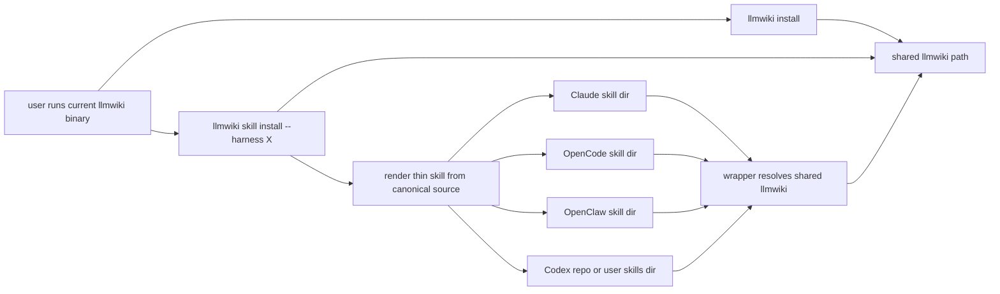

# 多 harness skill 分发与共享 CLI 安装实施计划

## Overview

本计划用于为 `llmwiki` 增加一套面向 Claude、OpenCode、OpenClaw 与 Codex 的 skill 分发机制，同时引入共享 CLI 安装路径，使各 harness 的 skill 仅负责调用同一份已安装的 `llmwiki`，而不是各自内嵌二进制或承担复杂下载逻辑。

计划的目标不是把现有 CLI 改造成第二套产品形态，而是围绕当前 Rust CLI 建立一个更清晰的接入层：CLI 继续承担确定性执行面，skill 只负责把 `llmwiki` 工作流暴露给不同 agent harness，并通过轻量 wrapper 调用共享安装位置中的 `llmwiki`。

## Problem Frame

当前仓库已经具备 `convert`、`doctor`、`prepare-ingest`、`lint`、`sync-state`、`rebuild-index` 等 CLI 能力，也已经把视频 sidecar 安装与 README 结构收束到较清晰的边界内。但在多 harness 接入层，仍缺少一套明确策略：

- `init` 是否默认把某个 harness 的 skill 写进模板仓库，目前尚无稳定方案。
- skill 是否应携带 `llmwiki` 本体，还是只负责调用共享 CLI，目前尚无正式契约。
- `llmwiki` 本体应安装到何处、多个 harness 如何共享、何时覆盖旧版本，目前尚无统一命令面。
- 不同 harness 的默认 skill 目录并不完全相同，尤其 Codex 这一侧需要按其官方 scope 规则区分 repo、user、admin 与 system 位置。

如果这些问题不先收束，后续实现会在“项目模板”“全局安装”“二进制分发”“wrapper 行为”“多 harness 目标路径”之间反复摇摆，最终导致安装体验与维护边界都不稳定。

## Requirements Trace

- R1. skill 安装必须是显式动作，`llmwiki init` 默认不安装任何 harness skill。
- R2. `llmwiki init` 必须支持可选参数，在初始化后顺带安装一个或多个指定 harness 的 skill。
- R3. `llmwiki skill install --harness <name>` 必须成为用户级入口，并默认确保共享 CLI 已安装可用。
- R4. skill 不得内嵌 `llmwiki` 二进制；skill 内仅可包含说明、wrapper 与少量辅助文件。
- R5. `llmwiki install` 必须把当前正在运行的 CLI 安装到共享路径，供所有 harness 复用。
- R6. Windows 侧 wrapper 不应依赖 PowerShell 执行策略；第一版以 `.cmd` 为主即可。
- R7. skill 内容应维护一份 canonical source，再渲染为各 harness 的薄入口，而不是手工维护多份近似副本。
- R8. Claude、OpenCode、OpenClaw 的安装目标目录应采用其已知支持的用户级 skill 目录；Codex 必须按其官方 scope 规则支持 repo 与 user 位置，并避免自行发明额外路径。
- R9. 第一版不提供名为 `update` 的命令，直到远程 release 查询与自更新真正存在。
- R10. 安装与诊断必须可测试，尤其要覆盖共享 CLI 复用、目标目录写入与 `init --install-skill` 的组合路径。

## Scope Boundaries

- 不在本计划中实现远程自更新、release 查询或版本漂移提示。
- 不在本计划中把 skill 默认写进 `init` 生成的项目模板目录。
- 不在本计划中把 `llmwiki` 二进制嵌入 skill 目录。
- 不在本计划中为不同 harness 维护不同语义版本的 skill 指令；各 harness 的差异仅限于目录布局与薄入口适配。
- 不在本计划中实现 Codex 的 admin 级或 system 级 skill 管理；第一版只覆盖 repo 与 user 两种显式安装作用域。

## Context & Research

### Relevant Code and Patterns

- `src/sidecar.rs` 已经实现“优先解析显式路径，再解析仓库或系统级位置”的安装与探测模式，可作为共享 CLI 安装路径解析的直接参考。
- `src/commands/doctor.rs` 与 `src/convert/mod.rs` 已经建立 `doctor` 输出与外部依赖探测的风格，可延展为 skill / CLI 诊断。
- `src/repo.rs` 已经承担 `init` 阶段的模板与基础文件落地逻辑；`init --install-skill` 只应在该流程结束后调用统一安装逻辑，而不应复制第二份实现。
- `README.md`、`README.zh-CN.md`、`README.en.md` 已经建立“入口页 + 双语完整说明”的文档结构，适合继续承接 skill 安装说明。

### External References

- Claude Code 官方文档确认支持用户级与项目级 skill 目录，分别为 `~/.claude/skills/` 与 `.claude/skills/`，并明确 skill 目录可包含 `SKILL.md` 之外的 supporting files，如 `scripts/` 与 `templates/`。[Claude Docs](https://docs.claude.com/en/docs/claude-code/skills)
- OpenCode 官方文档确认会发现 `.opencode/skills/`、`.claude/skills/` 与 `.agents/skills/` 的项目级与全局 skill 目录，并给出全局原生目录 `~/.config/opencode/skills/`。[OpenCode Docs](https://opencode.ai/docs/skills)
- OpenClaw 官方文档确认支持用户级 `~/.openclaw/skills/`、`~/.agents/skills/` 与项目级 `skills/` / `.agents/skills/`，并以 `SKILL.md` 为核心目录结构。[OpenClaw Docs](https://docs.openclaw.ai/tools/skills)

### External References for Codex

- Codex 官方 skill 位置说明确认了四类 scope：
  - repo：从当前工作目录向上扫描到仓库根目录范围内的 `.agents/skills/`
  - user：`$HOME/.agents/skills`
  - admin：`/etc/codex/skills`
  - system：Codex 内置 skills
- 因此，Codex 已明确支持项目级 `.agents/skills`；先前“项目级路径未证实”的判断不成立，后续实现应按该规则修正。

## Key Technical Decisions

- 决策 1：新增 `llmwiki install`，其职责是把当前正在运行的 `llmwiki` 安装到共享 CLI 路径，而不是联网拉取 release。
  理由：用户既然已经能运行当前二进制，就说明安装源已经存在；第一版只需把它复制到统一共享位置，避免把远程下载、自更新和版本协商提前耦合进来。

- 决策 2：新增 `llmwiki skill install --harness <name>`，并将其定义为组合动作：先确保共享 CLI 已安装，再写入 harness skill。
  理由：从用户心智看，“安装 skill”意味着“让这个 harness 现在可用”，而不是“只复制一份说明文件”。

- 决策 3：`llmwiki init` 默认不安装 skill，只在完成后给出下一步提示；当用户传入 `--install-skill <name>` 时，复用同一套 `skill install` 逻辑。
  理由：这既满足模板仓库中立性，也满足“初始化后一步到位”的使用需求。

- 决策 4：skill 不内嵌 `llmwiki` 二进制；skill 只分发 `SKILL.md`、wrapper 与少量说明文件。
  理由：内嵌二进制会引入平台分叉、重复拷贝、版本漂移与 Git 膨胀问题，也不符合 skill 作为工作流入口层的职责。

- 决策 5：Windows 侧 wrapper 第一版采用 `.cmd` 即可，不要求 PowerShell。
  理由：在 wrapper 仅承担“查找共享 CLI 并透传参数”的前提下，`.cmd` 已足够，且更少受执行策略影响。

- 决策 6：skill 模板采用 canonical source + 渲染生成模式，但第一版不必对外暴露 `skill render` 命令。
  理由：参考仓库的“脚本转换 skill”思路值得借鉴，但当前用户面真正需要的是 `install`，不是独立的模板渲染命令。

- 决策 7：Codex 第一版支持 `repo` 与 `user` 两种显式安装作用域，不覆盖 `admin` 与 `system`。
  理由：官方说明已明确 repo 与 user 的稳定路径；这两类作用域已经足以覆盖团队共享与个人复用场景。`admin` 与 `system` 属于机器级与产品内置层，第一版不必实现。

- 决策 8：第一版不提供 `update` 命令。
  理由：在不联网、不查询新版本、不执行真正自更新的前提下，`update` 这一命名会误导用户；现阶段仅保留 `install` 与 `install --force`。

## Open Questions

### Resolved During Planning

- skill 是否默认进入 `init` 产出的模板仓库：不默认进入。
- `init` 是否允许顺带安装 skill：允许，通过显式参数触发。
- `skill install` 是否应同时处理 CLI 安装：应当同时处理。
- skill 是否应携带 `llmwiki.exe`：不应携带。
- Windows 是否必须提供 PowerShell wrapper：不必，第一版 `.cmd` 足够。
- 是否要提供 `update`：当前不提供。
- Codex 是否支持项目级 skill：支持，按 `.agents/skills` 的 repo 扫描规则处理。

### Deferred to Implementation

- 共享 CLI 的最终目录命名是“固定单路径覆盖”还是“按版本子目录存放并维护一个稳定入口”。
- `skill doctor` 是作为 `llmwiki skill doctor` 独立命令，还是合并到现有 `doctor` 输出中。
- OpenCode 第一版是否优先安装到原生目录 `~/.config/opencode/skills/`，还是优先安装到兼容路径 `~/.agents/skills/`。
- `install --print-path` 是否在第一版一并加入，还是先保留给后续易用性补强。

## High-Level Technical Design

> 下图仅用于表达命令职责与安装流向，属于方向性设计，不是实现规格。

方向性约束如下：

- 共享 CLI 是唯一执行面。
- skill 只是 harness 发现层，不承担复杂安装器职责。
- `skill install` 可以隐式触发 `install`，但不反过来写入任何 harness 文件。
- 各 harness 的 skill 目录由同一套 canonical 资产渲染而来。

## Implementation Units

- [x] **Unit 1: 定义共享 CLI 安装契约与目标路径解析**

**Goal:** 为 `llmwiki` 建立稳定的共享安装位置与覆盖策略，供所有 harness 复用同一份 CLI。

**Requirements:** [R3, R5, R9]

**Dependencies:** None

**Files:**
- Create: `src/install.rs`
- Modify: `src/lib.rs`
- Modify: `src/cli.rs`
- Modify: `src/repo.rs`
- Test: `tests/install_command.rs`

**Approach:**
- 把“共享 CLI 安装路径解析”从 harness 逻辑中独立出来，形成单独模块。
- `llmwiki install` 从当前运行中的可执行文件拷贝到共享路径；`--force` 负责覆盖。
- 共享路径解析要按平台分支，但对调用方暴露统一接口。
- 若当前运行环境无法确定稳定安装路径，应返回明确诊断，而不是默默失败。

**Patterns to follow:**
- `src/sidecar.rs`
- `src/commands/doctor.rs`

**Test scenarios:**
- Happy path: 在临时环境执行 `llmwiki install`，共享路径生成目标二进制且可再次启动。
- Edge case: 共享路径已存在 CLI，再次执行不带 `--force` 的 `install`，应保持幂等或给出清晰提示。
- Error path: 当前可执行文件不可复制或目标目录不可写时，命令返回明确错误。

**Verification:**
- 不依赖任何 harness 文件时，当前 CLI 已可被安装到共享路径并独立执行。

- [x] **Unit 2: 建立 canonical skill 资产与多 harness 渲染层**

**Goal:** 维护一份 skill canonical source，并能渲染出 Claude、OpenCode、OpenClaw、Codex 所需的薄入口目录结构。

**Requirements:** [R4, R6, R7, R8]

**Dependencies:** Unit 1

**Files:**
- Create: `skill-src/llm-wiki/SKILL.md`
- Create: `skill-src/llm-wiki/scripts/llmwikiw.cmd`
- Create: `skill-src/llm-wiki/scripts/llmwikiw.sh`
- Create: `skill-src/llm-wiki/README.md`
- Create: `src/skill/mod.rs`
- Create: `src/skill/assets.rs`
- Create: `src/skill/render.rs`
- Test: `tests/skill_render.rs`

**Approach:**
- skill 源目录只保留一套 canonical 内容，包含中立的工作流说明与 wrapper 模板。
- 渲染层根据 harness 类型输出不同目标目录布局与少量差异化说明，不复制核心指令内容。
- wrapper 只负责解析 `LLMWIKI_BIN`、共享 CLI 路径与参数透传；找不到 CLI 时提示先运行 `llmwiki install`。
- Windows 侧输出 `.cmd`，Unix 侧输出 `.sh`。

**Patterns to follow:**
- 参考 `sdyckjq-lab/llm-wiki-skill` 的“共享核心 + 平台薄入口”思路
- 当前仓库双语 README 的“入口页 + 详细说明”组织方式

**Test scenarios:**
- Happy path: 渲染 Claude skill 时，生成 `SKILL.md` 与 wrapper，且内容包含共享 CLI 调用说明。
- Happy path: 渲染 OpenCode 与 OpenClaw skill 时，目录布局符合对应 harness 目标结构。
- Edge case: 同一 canonical 源渲染多个 harness 时，公共说明内容保持一致，仅入口差异化。
- Error path: 传入未知 harness 时，渲染层返回明确错误。

**Verification:**
- 仓库内只维护一份 canonical skill 内容，且足以生成各 harness 薄入口。

- [x] **Unit 3: 实现 `llmwiki skill install` 与 harness 目标目录解析**

**Goal:** 为用户提供统一 skill 安装入口，并把各 harness 的安装目标目录与作用域收敛到明确策略。

**Requirements:** [R1, R3, R4, R8, R10]

**Dependencies:** Unit 1, Unit 2

**Files:**
- Create: `src/commands/skill.rs`
- Create: `src/skill/install.rs`
- Create: `src/skill/targets.rs`
- Modify: `src/commands/mod.rs`
- Modify: `src/cli.rs`
- Test: `tests/skill_install_command.rs`

**Approach:**
- 新增 `llmwiki skill install --harness <name>` 命令，并支持 `--scope`。
- 安装动作顺序固定为：解析 harness 目标目录与作用域 → 确保共享 CLI 已安装 → 渲染 skill → 写入目标目录 → 输出诊断结果。
- Claude 目标采用 `~/.claude/skills/llm-wiki`。
- OpenCode 目标采用其原生全局目录或确认后的兼容目录策略。
- OpenClaw 目标采用 `~/.openclaw/skills/llm-wiki`。
- Codex 目标默认支持两种作用域：
  - `repo`：`<repo-root>/.agents/skills/llm-wiki`
  - `user`：`$HOME/.agents/skills/llm-wiki`
- Codex 若需 `admin` 作用域，第一版明确不实现；后续另立计划。

**Patterns to follow:**
- `src/sidecar.rs` 的路径探测与优先级处理
- `src/commands/install_sidecar.rs` 的安装摘要输出风格

**Test scenarios:**
- Happy path: 执行 `skill install --harness claude`，共享 CLI 与 skill 目录均正确写入。
- Happy path: 执行 `skill install --harness codex --scope repo`，目标 skill 安装到 `<repo-root>/.agents/skills/llm-wiki`。
- Happy path: 执行 `skill install --harness codex --scope user`，目标 skill 安装到 `$HOME/.agents/skills/llm-wiki`。
- Edge case: 共享 CLI 已安装时再次执行 `skill install`，应复用现有 CLI，不重复失败。
- Error path: 对不支持 `--scope` 的 harness 传入无效作用域，命令返回明确指导。
- Integration: 不同 harness 安装后，其 wrapper 均能定位同一份共享 CLI。

**Verification:**
- 用户只需运行一条 `skill install` 命令，即可让指定 harness 进入可用状态。

- [x] **Unit 4: 扩展 `init` 命令以支持可选 skill 安装与初始化提示**

**Goal:** 保持模板仓库默认中立，同时允许用户在初始化阶段显式安装 skill。

**Requirements:** [R1, R2, R10]

**Dependencies:** Unit 3

**Files:**
- Modify: `src/cli.rs`
- Modify: `src/commands/init.rs`
- Modify: `src/repo.rs`
- Test: `tests/cli_init.rs`

**Approach:**
- 为 `llmwiki init` 增加可重复传入的 `--install-skill <harness>` 参数。
- `init` 在完成仓库骨架创建后，逐个调用统一的 `skill install` 逻辑。
- 当用户未传入 `--install-skill` 时，仅在 `init` 输出中提示可执行的下一步命令，不修改任何 harness 目录。
- 避免把 skill 文件默认写进仓库工作树，保持模板仓库本身的中立与简洁。

**Patterns to follow:**
- `src/commands/init.rs`
- `src/repo.rs`

**Test scenarios:**
- Happy path: `llmwiki init --install-skill claude` 在初始化后成功安装 Claude skill。
- Edge case: 不带 `--install-skill` 执行 `init`，仅生成仓库骨架，不产生 skill 目录副作用。
- Integration: 多次传入 `--install-skill` 时，各 harness 安装按顺序完成，且仓库初始化仍成功。

**Verification:**
- `init` 默认保持中立；显式参数可一步完成“建仓 + 接入指定 harness”。

- [x] **Unit 5: 增补诊断、文档与回归测试**

**Goal:** 让 skill / install 能力具备可观测性、可文档化与可回归验证的交付形态。

**Requirements:** [R3, R7, R10]

**Dependencies:** Unit 1, Unit 2, Unit 3, Unit 4

**Files:**
- Modify: `README.md`
- Modify: `README.zh-CN.md`
- Modify: `README.en.md`
- Modify: `docs/ARCHITECTURE.md`
- Modify: `src/commands/doctor.rs`
- Modify: `src/convert/mod.rs`
- Test: `tests/install_command.rs`
- Test: `tests/skill_install_command.rs`
- Test: `tests/cli_init.rs`

**Approach:**
- 在文档中新增“共享 CLI 安装”与“harness skill 安装”说明，明确区别于项目模板本体。
- 扩展 `doctor` 或新增 `skill doctor`，使用户可检查共享 CLI 是否已安装、各 harness skill 是否存在、wrapper 是否可调用。
- 在中文与英文 README 中保持同等信息密度，不只在单一语言文档中描述 skill 工作流。

**Patterns to follow:**
- 当前双语 README 结构
- `doctor` 的摘要输出风格

**Test scenarios:**
- Happy path: `doctor` 或 `skill doctor` 能识别已安装的共享 CLI 与 harness skill。
- Edge case: 共享 CLI 缺失但 skill 已存在时，诊断能指出缺口而非仅报告模糊失败。
- Edge case: harness 目录存在但 `SKILL.md` 或 wrapper 缺失时，诊断能指出具体缺失项。

**Verification:**
- 用户无需阅读源码即可理解 install / skill install 的关系，并可通过诊断命令快速定位安装问题。

## System-Wide Impact

- **Interaction graph:** `cli` 命令面将新增一层“共享 CLI 安装 + harness skill 安装”能力，但不会改变 `convert`、`prepare-ingest`、`lint` 等既有业务命令的输入输出契约。
- **Error propagation:** 安装类命令需要把“共享 CLI 安装失败”“目标 harness 目录不可写”“wrapper 渲染失败”“Codex scope 不受支持”区分成可操作的错误，而不是统一收敛为安装失败。
- **State lifecycle risks:** 新功能不应把任何安装状态写入 `state/`；安装结果应完全由文件系统上的目标路径反映。
- **API surface parity:** `skill install` 与 `init --install-skill` 必须共用同一实现路径，避免两套行为产生偏差。
- **Integration coverage:** 需要覆盖“共享 CLI 已存在 + 多 harness 依次安装 + wrapper 统一指向共享 CLI”的组合场景。
- **Unchanged invariants:** `AGENTS.md`、`wiki/`、`raw/`、`state/` 的业务边界不因 skill 接入而改变；skill 只是 `llmwiki` 的接入层，不是新的知识写入层。

## Risks & Dependencies

| Risk | Mitigation |
|------|------------|
| 各 harness 的默认 skill 目录长期演化，导致安装目标失效 | 将目录解析集中在 `src/skill/targets.rs`，并在文档中标明版本边界与可覆盖参数 |
| Codex 目录策略若偏离官方 scope 规则，后续可能误装到错误位置 | 第一版严格按官方的 repo / user 作用域实现，不额外发明路径 |
| skill 与共享 CLI 版本脱钩，导致 wrapper 调用异常 | skill wrapper 只调用共享 CLI 的稳定路径，不在 skill 内写死版本号 |
| 用户误以为 `skill install` 会安装到项目仓库 | 文档、帮助文本与 `init` 输出中明确说明默认为用户级安装 |

## Documentation / Operational Notes

- 文档中应明确区分三类动作：初始化仓库、安装共享 CLI、安装 harness skill。
- 帮助文本需要写清 `install` 与 `skill install` 的关系，避免出现“为什么装了 skill 还找不到 CLI”的疑惑。
- 若后续引入真正的自更新，再基于本计划的共享 CLI 安装路径扩展 `update`，而不是重新设计一套并行机制。

## Sources & References

- Related code: `src/sidecar.rs`
- Related code: `src/commands/init.rs`
- Related code: `src/commands/doctor.rs`
- Related code: `src/convert/mod.rs`
- External docs: Codex official skill locations provided by user conversation context
- External docs: [Claude Skills](https://docs.claude.com/en/docs/claude-code/skills)
- External docs: [OpenCode Skills](https://opencode.ai/docs/skills)
- External docs: [OpenClaw Skills](https://docs.openclaw.ai/tools/skills)
